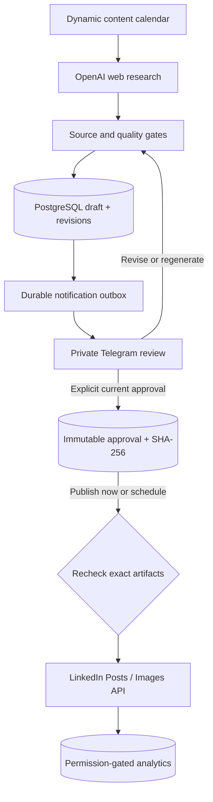

# LinkedIn AI Automation

[](https://github.com/atasardacagan/linkedin-ai-automation/actions/workflows/ci.yml)

A self-hosted, single-operator LinkedIn content system. It researches current sources, drafts and reviews Turkish LinkedIn content with OpenAI, optionally generates original images, and uses Telegram as the non-technical review console. LinkedIn publishing is possible only after explicit human approval of the exact text and image.

The integration uses official APIs only. It does not automate a browser, store a LinkedIn password, scrape LinkedIn, or publish an unapproved revision.

> `DRY_RUN=true` is the default. A post cannot enter a publishable state until the configured Telegram administrator presses the current **ONAYLA** button. Every text or image revision invalidates the old approval button.

## What is included

- OpenAI Responses API content research with web-search source binding and strict JSON Schemas
- Public-address-pinned source retrieval, redirect revalidation, response-size limits, and a conservative source-support check
- Independent AI quality review, deterministic weighted scoring, and embedding-based duplicate detection
- Optional `gpt-image-2` visuals stored as immutable, content-addressed PNG files
- Telegram preview, approval, rejection, regeneration, text revision, image revision, scheduling, and natural-language administration
- Official LinkedIn versioned Posts and Images APIs for member publishing
- Optional permission-gated member post analytics and weekly Telegram reports
- PostgreSQL schema and Alembic migration compatible with standard PostgreSQL and Supabase Postgres
- Durable Telegram update inbox, pending conversations, generation leases, notification outbox, retries, audit events, and publication reconciliation
- Docker Compose, locked runtime dependencies, PostgreSQL integration tests, dependency audit, image vulnerability scan, and CI

## System flow



See [Architecture](docs/ARCHITECTURE.md) for lifecycle and failure semantics, [LinkedIn OAuth](docs/LINKEDIN_OAUTH.md) for account authorization, [Operations](docs/OPERATIONS.md) for deployment and recovery, [API research](docs/API_RESEARCH.md) for the verified platform capabilities, and [Security policy](SECURITY.md) for private reporting and credential incidents.

## Safe installation

Requirements: Docker Engine or Docker Desktop with Docker Compose, a public HTTPS origin for the Telegram webhook, and credentials for OpenAI, Telegram, and LinkedIn.

```bash
git clone https://github.com/atasardacagan/linkedin-ai-automation.git
cd linkedin-ai-automation
cp .env.example .env
python3 scripts/generate_secrets.py
```

Copy both generated values into `.env`. Put the generated `POSTGRES_PASSWORD` into both `POSTGRES_PASSWORD` and the password segment of `DATABASE_URL`. The generator uses URL-safe characters, so no URL encoding is needed.

Complete the provider-specific values described in [LinkedIn OAuth](docs/LINKEDIN_OAUTH.md) and the Telegram bootstrap section below. Then validate configuration without printing secrets:

```bash
make preflight
docker compose up -d --build
curl --fail http://localhost:8000/health
```

The Compose migration job upgrades the database and seeds default topics before the unprivileged, read-only application container starts. The only writable application path is the persistent image volume.

Production configuration fails closed when the HTTPS URL, database URL, administrator IDs, webhook secret, access token, author URN, token expiry, or OpenAI key is missing or still contains a sample value.

## Required configuration

| Variable | Meaning |
|---|---|
| `POSTGRES_PASSWORD` | Password for the bundled local PostgreSQL service |
| `DATABASE_URL` | `postgresql+asyncpg://…` application connection URL |
| `PUBLIC_BASE_URL` | Real public HTTPS origin, with no query or fragment |
| `OPENAI_API_KEY` | OpenAI API key for research, drafting, review, embeddings, and images |
| `TELEGRAM_BOT_TOKEN` | Token created by Telegram BotFather |
| `TELEGRAM_ADMIN_CHAT_ID` | Only private chat allowed to control the system |
| `TELEGRAM_ADMIN_USER_ID` | Only Telegram user allowed to control the system |
| `TELEGRAM_WEBHOOK_SECRET` | Random secret checked on every Telegram webhook request |
| `LINKEDIN_ACCESS_TOKEN` | Member OAuth token containing `w_member_social` |
| `LINKEDIN_ACCESS_TOKEN_EXPIRES_AT` | ISO-8601 expiry, for example `2026-11-05T12:00:00Z` |
| `LINKEDIN_AUTHOR_URN` | Current member author, `urn:li:person:<application-scoped-id>` |
| `LINKEDIN_VERSION` | Supported LinkedIn Marketing API header; default `202608` |

Optional analytics remains off until LinkedIn grants `r_member_postAnalytics`. When it is granted, set `LINKEDIN_ANALYTICS_ENABLED=true`. The daily call budget and lookback window are configurable and the budget counter persists in PostgreSQL across restarts.

Never commit `.env`, paste credentials into Telegram, or include them in support logs. The repository contains no live credentials.

## Telegram bootstrap

1. In Telegram, open **@BotFather**, create a bot with `/newbot`, and copy the bot token into `.env`.
2. Open the new bot, press **Start**, and send `/start` once.
3. Run `make bootstrap-telegram`.
4. Copy the two printed `TELEGRAM_ADMIN_…` lines into `.env`.

The helper never prints the bot token. The application registers `PUBLIC_BASE_URL/webhooks/telegram` at startup and verifies Telegram's secret-token header. Only the exact configured user in the exact configured private chat is accepted; all other messages are ignored.

If that bot already has a webhook, remove the old webhook in the Telegram Bot API before running the bootstrap helper, or retrieve the two IDs from that existing deployment.

## Human approval workflow

1. A scheduled or `/generate` request creates a researched draft.
2. Telegram receives the original PNG as a document, source links, metadata, the complete final commentary, and review buttons.
3. **REVİZE ET**, **YENİDEN ÜRET**, or **GÖRSELİ DEĞİŞTİR** creates a new immutable revision and a new 48-hour nonce. The previous keyboard becomes unusable.
4. **ONAYLA** freezes the canonical commentary—including hashtags—and the selected image. The immutable approval row records the exact revision, approver, time, and SHA-256 digests.
5. The administrator separately chooses **HEMEN PAYLAŞ** or **PLANLA**. Scheduling never bypasses approval.
6. Immediately before LinkedIn receives anything, the publisher recomputes both digests. Missing or changed artifacts stop permanently and require a new reviewed draft.

The default automatic draft calendar is Monday, Wednesday, and Friday at 09:00 in `Europe/Istanbul`. It creates drafts for review; it does not approve them.

## Telegram controls

| Command | Purpose |
|---|---|
| `/generate <topic>` | Research and create one idempotent draft |
| `/topics` | List active content areas |
| `/addtopic <topic>` | Add or reactivate an area |
| `/removetopic <topic>` | Deactivate an area |
| `/drafts` | List recent reviewable drafts |
| `/schedule` | Show the generation calendar and scheduled approved posts |
| `/history` | Show published and rejected posts |
| `/analytics` | Show the latest stored performance totals |
| `/pause`, `/resume` | Stop or resume automatic draft generation |
| `/status`, `/settings` | Show safe operational state; secrets are never displayed |
| `/cancel` | Cancel the current revision/scheduling/confirmation conversation |
| `/retryalerts` | Requeue Telegram notifications that exhausted retries |
| `/reconcile …` | Resolve an ambiguous LinkedIn result after checking the profile |

Natural-language examples are also supported:

- `İçerik alanlarına otomotiv ve veri analitiğini ekle.`
- `Haftada iki taslak üret, salı ve cuma günleri olsun.`
- `Taslakları saat 08:30'da hazırla.`
- `Gelecek haftaya kadar otomatik üretimi atla.`
- `Daha kısa, teknik ve örnek odaklı yaz.`

Potentially destructive natural-language changes require a separate `evet` confirmation. Intent execution requires at least 85% model confidence; ambiguous requests are not applied.

## LinkedIn API status on 2026-09-06

LinkedIn's self-service **Share on LinkedIn** product grants `w_member_social` for the authenticated member. This service creates posts with `POST /rest/posts`, `LinkedIn-Version`, and `X-Restli-Protocol-Version: 2.0.0`; images use `POST /rest/images?action=initializeUpload` followed by the returned upload URL. No private or legacy browser endpoint is used.

The configured header is `202608`. LinkedIn documents it as active through 2027-08-17, but versions are released monthly and supported for at least one year, so review the migration table quarterly rather than waiting for expiry.

Member analytics uses `GET /rest/memberCreatorPostAnalytics`. It is not part of the basic posting grant: `r_member_postAnalytics` requires the relevant approved access. There is deliberately no scraping fallback.

Official references: [Getting access](https://learn.microsoft.com/en-us/linkedin/shared/authentication/getting-access), [Posts API](https://learn.microsoft.com/en-us/linkedin/marketing/community-management/shares/posts-api), [Images API](https://learn.microsoft.com/en-us/linkedin/marketing/community-management/shares/images-api), [Member Post Statistics](https://learn.microsoft.com/en-us/linkedin/marketing/community-management/members/post-statistics), and [version migrations](https://learn.microsoft.com/en-us/linkedin/marketing/integrations/migrations).

## OpenAI integration

Responses API calls use strict Structured Outputs and `store=false`. Web-research URLs are accepted only when they also appear in the API's web-search source list and pass local network/content checks. The second quality review is an additional gate, not a guarantee of factual correctness; the human remains responsible for the final post.

Defaults are `gpt-5.6-terra`, `gpt-image-2`, and `text-embedding-3-small`. All model names remain configurable for API-account availability. Image-generation failure is audited and a valid text draft may still proceed without an image.

Official references: [OpenAI models](https://developers.openai.com/api/docs/models), [GPT-5.6 Terra](https://developers.openai.com/api/docs/models/gpt-5.6-terra), and [GPT-Image-2](https://developers.openai.com/api/docs/models/gpt-image-2).

## PostgreSQL and Supabase

The schema uses native PostgreSQL UUID, JSONB, array, enum, index, trigger, and row-lock features. No extension is required. For Supabase:

- Use the direct database connection for Alembic migrations.
- Use a persistent/session connection suitable for `asyncpg` for the long-running service.
- Require TLS according to the current Supabase connection instructions.
- Do not expose service-role keys or database credentials to a browser or Telegram.
- Test migration upgrade and restore against a staging project before production.

Tables are `posts`, `revisions`, `approvals`, `topics`, `analytics`, `settings`, `audit_events`, `generation_runs`, `notification_outbox`, `telegram_update_inbox`, and `telegram_pending_actions`. Completed Telegram inbox payloads are erased; audit, revision, and approval rows are protected by immutable database triggers.

## Failure and retry policy

- Source, AI, and safe pre-publication failures use bounded retries and durable generation runs.
- Telegram webhooks are acknowledged after durable enqueueing, deduplicated by `update_id`, and processed at least once. State-changing handlers use post slots, current nonces, row locks, and audit replay checks.
- Telegram notifications use a durable outbox with exponential backoff and a dead-letter state after eight attempts.
- LinkedIn connectivity and image-upload failures before post creation are safe to retry.
- A timeout, dropped connection, or server error after `POST /rest/posts` has an unknown outcome. Automatic retries stop and `requires_reconciliation` is set to prevent duplicate public posts.
- `DRY_RUN=true` performs no LinkedIn network request and leaves the approved post publishable for a later explicit action.

## Development and verification

```bash
python3 -m venv .venv
source .venv/bin/activate
python -m pip install -r requirements-dev.lock
python -m pip install --no-deps -e .
ruff format --check .
ruff check .
pytest -q
alembic upgrade head --sql
```

CI runs lint and formatting checks, audits the locked runtime and development dependencies, upgrades/seeds/downgrades/re-upgrades a real PostgreSQL 16 database, runs unit and PostgreSQL integration tests, builds the non-root image, performs a container health smoke test, and fails on high or critical image vulnerabilities. CodeQL analyzes Python on changes and weekly; Dependabot tracks Python, GitHub Actions, and Docker updates.

## Scope and roadmap

This release supports personal-member text and single-image posts controlled through Telegram. It does not yet implement organization posting, carousels, video, WhatsApp Business, automatic comments, automatic direct messages, or multi-tenant OAuth. Those capabilities require separate permissions, policy review, and additional adapters; they are intentionally not simulated with scraping.

Planned extension points include a WhatsApp Business Cloud adapter using the same approval service, object storage, pgvector for very large histories, and separate web/scheduler/worker processes for horizontal scaling.

## License

MIT © 2026 `atasardacagan`
