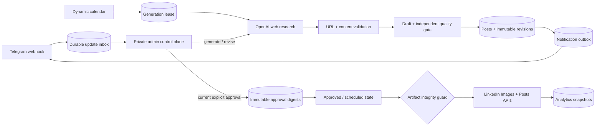
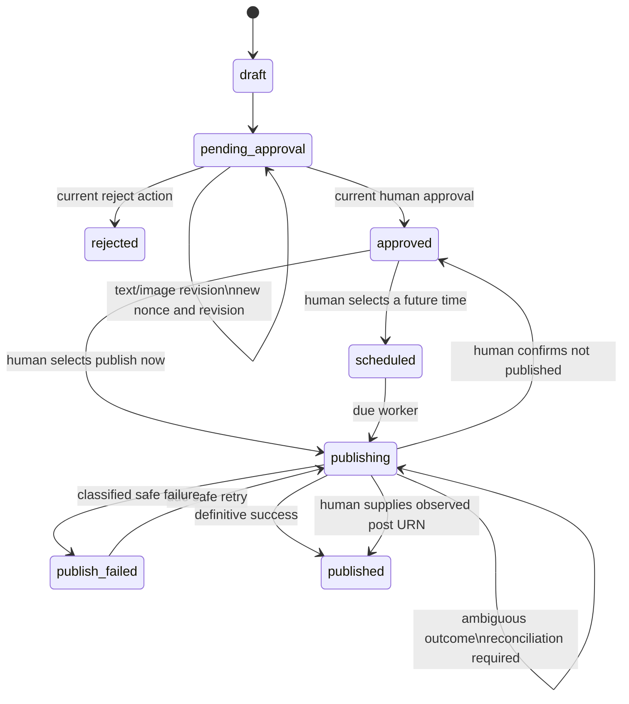

# Architecture

## Purpose and deployment model

The service is a single-operator control plane for personal LinkedIn content. FastAPI receives authenticated Telegram webhooks, PostgreSQL owns workflow state, APScheduler runs durable jobs, OpenAI supplies research/drafting/review/image capabilities, and LinkedIn's official versioned APIs perform the final approved publication.

One application replica is the supported topology for this release because the scheduler is in-process. Database locks and idempotency records protect work from ordinary retries and restarts, but weekly reports and token-expiry messages are intentionally optimized for one scheduler. Split web, scheduler, and workers before horizontal scaling.



## Components

| Component | Responsibility |
|---|---|
| `main.py` | FastAPI lifecycle, health check, Telegram webhook secret validation, durable enqueue |
| `telegram_inbox.py` | Update deduplication, leases, retries, dead-letter state, payload erasure after completion |
| `telegram.py` | Private administrator authorization, commands, callbacks, natural-language intents, persistent pending actions |
| `scheduler.py` | Calendar slots, generation leases, due publications, notification drain, stale-publication detection |
| `research.py` | SSRF-resistant public-address resolution, DNS pinning, redirect revalidation, bounded textual retrieval |
| `ai.py` | Structured research, scoring, draft/revision, quality review, embeddings, atomic image creation |
| `service.py` | Post lifecycle, approval and artifact digests, publication gate, retry classification, reconciliation |
| `linkedin.py` | Official REST headers, image initialization/upload, post creation, member analytics |
| `analytics.py` | Persistent daily call budget, snapshots, engagement calculation, weekly report, token-expiry warning |
| `notifier.py` | Transactional Telegram notification outbox and bounded retry |

## Post lifecycle



`revision_requested` remains in the enum for backward-compatible reporting, while the current Telegram conversation keeps the post in `pending_approval` and stores the pending instruction separately. This prevents a half-finished conversation from making the draft unreviewable after a restart.

## Non-bypassable approval invariants

1. New content starts in `draft` and is committed as `pending_approval`; generation alone never creates `approved`, `scheduled`, or `published` state.
2. Telegram accepts privileged input only when both the user ID and private-chat ID match configuration.
3. Review callbacks contain the post UUID and a cryptographically random nonce that expires after 48 hours. Approval, revision, image revision, and rejection acquire a row lock and compare the current nonce.
4. Every revision creates an immutable `revisions` row and rotates the nonce. A keyboard from any prior revision is stale.
5. Approval stores the selected revision ID, canonical commentary digest, optional content-addressed image digest, actor, and timestamp in an immutable `approvals` row. The nonce is consumed.
6. Scheduling accepts only an approved post and a future timezone-aware timestamp.
7. Publishing loads the approval row and recomputes both SHA-256 values. The exact approved commentary—not the mutable draft—is sent. Any missing or changed artifact becomes a permanent integrity failure.
8. A database check constraint prevents publishable statuses without an approval timestamp and frozen text. The publisher additionally requires the immutable approval record and matching digests.
9. `DRY_RUN=true` returns before any LinkedIn network request. It records a dry-run notification and restores the post to `approved`.

These controls are implemented in application transactions and PostgreSQL—not in an AI prompt.

## At-least-once delivery and idempotency

Telegram expects a fast webhook response. The endpoint validates its secret header and one-megabyte body limit, rejects every payload that is not from the configured administrator's private chat, then inserts the update keyed by Telegram's unique `update_id`. The background worker leases the row, runs the handler, and clears the stored payload after success. Failed work uses exponential backoff and becomes `dead` after eight attempts.

Because a process can stop after a side effect but before acknowledging its inbox row, handlers are replay-safe:

- manual generation uses `telegram:<update_id>` as the unique post generation slot;
- scheduled generation uses a timezone/date/time slot in `generation_runs` and `posts`;
- approval, revision, image revision, scheduling, rejection, dry run, and reconciliation recognize the previously committed audit actor for the same Telegram update;
- nonces and post row locks reject stale competing actions;
- notification rows carry unique semantic idempotency keys.

Telegram itself does not offer an exactly-once message-send transaction with PostgreSQL, so a notification may rarely be delivered twice if the process stops after Telegram accepts it but before the outbox row is marked sent. A public LinkedIn post is treated more conservatively, as described below.

## LinkedIn outcome classification

| Failure point | Classification | Behavior |
|---|---|---|
| Connection failure before request | Safe transient | Backoff and retry |
| Image initialization/upload error | Safe pre-publication | Backoff or permanent stop by status |
| HTTP 429 from post creation | Safe transient | Schedule bounded retry |
| Definitive 4xx rejection | Permanent | Stop and notify |
| Timeout/disconnect after post request | Ambiguous | Do not retry; require reconciliation |
| HTTP 5xx from post request | Ambiguous | Do not retry; require reconciliation |
| Missing `x-restli-id` after success | Unknown | Do not retry; require reconciliation |

Once a post request may have reached LinkedIn, automatic replay could create a duplicate. The post therefore stays `publishing` with `requires_reconciliation=true`. The operator checks the LinkedIn profile and uses the full database UUID with one of:

```text
/reconcile <UUID> published <urn:li:share:...>
/reconcile <UUID> not-published
```

The second resolution returns the unchanged approved artifact to `approved`; another explicit **HEMEN PAYLAŞ** action is required.

## Research and quality boundary

The Responses API must return strict schemas. A research item is retained only if its normalized URL appears in the web-search tool's source list. Local validation then rejects credentials in URLs, non-HTTP(S) schemes, nonstandard ports, any DNS result containing a non-public address, unvalidated redirects, non-text responses, unsuccessful responses, and bodies above 1.5 MB. HTTPS requests connect to the validated IP while retaining the original hostname for Host/SNI.

The supporting-term overlap check helps catch broken or invented citations; it is not semantic proof. A separate model quality review checks claims and editorial quality, deterministic scoring enforces the opportunity threshold, embeddings reject near-duplicates from the recent 90-day window, and the final human review remains mandatory.

## Storage and database design

- `posts`: mutable lifecycle record and the exact frozen publish artifacts
- `revisions`: append-only text/image versions
- `approvals`: one append-only approval per post, linked to its exact revision
- `topics`: case-insensitive unique, dynamically activated/deactivated content areas
- `settings`: calendar, pause, style feedback, token warning marker, and daily API counters
- `generation_runs`: idempotent calendar slots, leases, retry schedule, and outcome
- `telegram_update_inbox`: durable inbound work and dead-letter state
- `telegram_pending_actions`: restart-safe revision, image, schedule, and confirmation conversations
- `notification_outbox`: durable outbound alerts and dead-letter state
- `analytics`: timestamped metric snapshots
- `audit_events`: append-only actors and security/workflow events

PostgreSQL triggers reject updates or deletes to revisions, approvals, and audit events. Generated images are written through a same-filesystem temporary file, hard-linked under their SHA-256 name, verified if already present, and made read-only. Docker mounts only `/app/storage` writable.

## Trust boundaries

- Telegram is an authenticated operator channel, not a secret store.
- OpenAI output is untrusted structured input and is validated before persistence or use.
- Web-search sources are untrusted network destinations and pass the SSRF/content gate.
- PostgreSQL is the workflow authority; application memory is never the sole queue or approval source.
- LinkedIn is an external side-effect boundary where responses can be ambiguous.
- HTTPS termination and host firewalling belong to the deployment platform.

## Analytics limitation

Basic member publishing uses `w_member_social`. Member reporting separately requires `r_member_postAnalytics` and appropriate LinkedIn approval. Collection is off by default, has no scraping fallback, records a persistent UTC daily call counter before making requests, and limits work to recently published posts that do not yet have a snapshot for the current UTC day.
